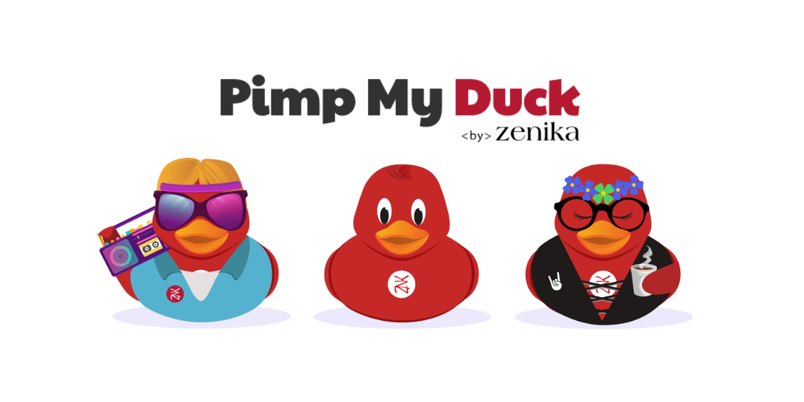

 

## Official app

Play on **[https://pimpmyduck.zenika.com](https://pimpmyduck.zenika.com)**.

## Contributing

Contributions, issues and feature requests are welcome! Feel free to check [issues page](https://github.com/zenika-open-source/my-zenikanard/issues).

See the [Asset proposal documentation](./proposals/README.md), if you want to add a new asset to Pimp My Duck.

All development instructions are explained in the [contributing guide](./.github/CONTRIBUTING.md).

For maintainers and changes on icons and shapes, see [this README](packages/assets/README.md).  

## License

This project is [Apache-2.0](https://github.com/zenika-open-source/my-zenikanard/blob/master/LICENSE) licensed. 
Copyright © 2020 [Zenika](https://oss.zenika.com).

